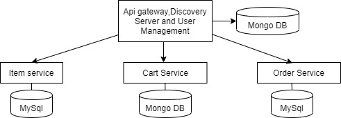

# grocery-app-microservices-api-daily-essentials
Daily Essential(Grocery App)

This is a microservice application.
Created using framework SpringBoot, Spring Data, Spring Security
Databases used are Mysql and MongoDB

High level design of this microservice app

Api gateway,User managment and discovery server are all part of first block.
Item service,Cart service, and order service are all the other services along with there respective databases as part of inital commits

All the respective API end points namely sigin-in etc.. has been given as part of postman collection in /postman_collections folder

As part of the infrastructure setup all the databases are in docker.All the relevant function and troubleshootiing docker commands has been included in /docker_related_documentation/ . If running on personal laptop on windows "docker quickstart terminal" is needed follow this link for guidance https://docs.docker.com/toolbox/toolbox_install_windows/ for linux and OSX just get docker and it things can start running. 

NOTE:
Upcoming feture in this repository making it scalable with the use of jenkins pipeline
